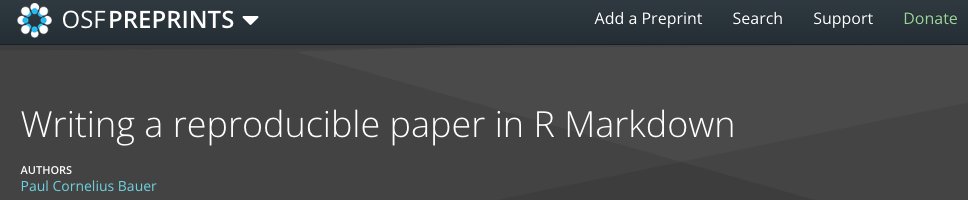
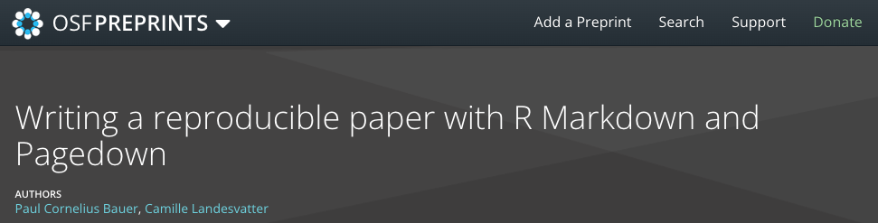

```{r setup, include=FALSE}
## Save package names as a vector of strings
pkgs <-
  c("rmarkdown",
    "knitr",
    "dplyr",
    "devtools",
    "widgetframe",
    "RefManageR",
    "bibtex",
    "plotly",
    "fontawesome")

## Install uninstalled packages
lapply(pkgs[!(pkgs %in% installed.packages())], install.packages)

## Load all packages to library and adjust options
lapply(pkgs, library, character.only = TRUE)

## Devtools install
if (!("icons" %in% installed.packages()))
  devtools::install_github("ropenscilabs/icons")
library(icons)

## Global chunk options
knitr::opts_chunk$set(echo = FALSE,
                      warning = FALSE,
                      message = FALSE)
options(scipen=999)
options(htmltools.dir.version = FALSE)

## RefManageR options
BibOptions(
  bib.style = "authoryear",
  hyperlink = "to.bib",
  style = "markdown",
  max.names = 3L
)
```


# Why reproducible research?

* **Reproducability**: Everyone (including yourself) can trace the steps that led to a particular result or statement. This increases transparency (and credibility).

* **Access**: Open access is given when research is freely available to everyone without any barriers, e.g., without requiring commercial software. E.g., 
```{r, out.width = "30%", fig.align='center', echo=F}
magick <- magick::image_read_pdf("workflow_access.pdf",
                       pages=1)
magick <- magick::image_trim(magick)
magick
```

* **Errors**: Everyone (including yourself) can spot errors. Plus, automation (e.g., code that produces findings is tied to the document itself) avoids a slow and error-prone cut-and-paste approach.

* **Revisions**: Revision of manuscripts and other pieces of research gets easier when steps are reproducible and automated. Plus, easy version control with git, etc.


---
# Tools for reproducible manuscripts in R

.pull-left[
* **rmarkdown**
  * combine R code and markdown-formatted text to produce HTML, PDF or Word documents
* **pagedown** *(Xie et al. 2022)*
  * R Markdown based
  * creates paginated HTML reports and prints to PDF
  * this includes headers, footers, etc.
  * highly customizable due to HTML and CSS styling sheets (YAML Metadata)
  * many available templates, e.g. CV, thesis, letter, journal templates

]

.pull-right[
* Other (R Markdown based): posterdown, bookdown, xaringan, etc.

```{r, out.width = "50%", fig.align='center', echo=F}
knitr::include_graphics("R-libraries.jpeg")
```

<font size="2">Source: Indrajeet Patil on Twitter</font size>

]
---
# Two templates (on OSF and Github)

.pull-left[

Bauer, P. 2021: 
```{r, out.width = "100%", fig.align='center', echo=F}

```


`r icons::fontawesome("github")`: /paulcbauer/Writing_a_reproducable_paper_in_rmarkdown

Bauer, P.; Landesvatter, C. 2022:
```{r, out.width = "100%", fig.align='center', echo=F}

```

`r icons::fontawesome("github")`: /paulcbauer/Writing_a_reproducable_paper_in_pagedown

]

.pull-right[
How can you use these templates?
  * clone github repositories including: 
    * 'paper.rmd'
    * 'references.bib'
    * 'data.csv'
    * 'american-sociological-association.csl'
    * styling files for pagedown: 'wp_paged.html', 'wp.css', 'wp-fonts.css', 'wp-pages.css'
  * open .Rproj
  * start creating your first manuscript in our working paper (wp) style or modify the styling sheets
]

---
# Pre-Requisites for R Markdown and Pagedown

Both require: installation of R + recommended: Rstudio IDE 

* R Markdown: 
  * rmarkdown package
  * other dependencies, e.g. knitr package
  * if you work without Rstudio: Pandoc Installation
  * if you want PDF output: a latex distribution, e.g. tinytex (a lightweight, cross-platform LaTeX distribution) 

```{r eval=F, echo=T}
install.packages(c('tinytex', 'rmarkdown'))
tinytex::install_tinytex()
```

* Pagedown:
  * all above + pagedown package
  
```{r eval=F, echo=T}
remotes::install_github('rstudio/pagedown')
```

---
class: center, middle

# Three Examples
## 1. Inline code & results 
## 2. Figures
## 3. Tables

---
# 1. Inline code & results

<u>Example 1:</u>

Writing 'r 3 + 7' (use back ticks!) will calculate and insert `r 3 + 7` into your text.   

<u>Example 2:</u>

Imagine you want to automate the display of regression coefficients within your manuscript.

```{r import-data, eval=T, echo=T}
data <- read.csv("data.csv")
```

```{r estimate-regression, eval=T, echo=T}
M1 <- lm(Fertility ~ Education + Agriculture, data = data)
```

Now we can write some plain text with inline code:
The coefficient of `Education` of the model we ran above is `r round(coef(M1)[2], 2)`.
`r round(coef(M1)[2], 2)` was printed by writing: 'r round(coef(M1)[2], 2)' (use back ticks!).

*What advantages does such a workflow bring?*
---
# 2. Figures

Example: You want to create, edit and insert a ggplot2 graph alongside its code and the text.

```{r eval=T, echo=T}
data$Education_cat <- cut(data$Education, 
                   breaks=c(-Inf, 6, 12, Inf), labels=c("low","middle","high"))
```


```{r fig-1, fig.cap="Fig 1. Fertility and Agriculture by Education", fig.align="center", fig.width=6, fig.height=3, eval=T, echo=T}
ggplot(data, aes(x=Catholic, y=Fertility, shape=Education_cat)) + geom_point() +
  labs(x="Agriculture", y = "Fertility", shape="Education") + theme_classic()
``` 

---
# 2. Figures

* For cross-referencing within your manuscript you can refer to Figure 1 by using `\@ref(fig:fig-1)`.

* But pay attention to your code chunk options. In the previous example:

<blockquote> <font size="6">{r fig-1, fig.cap="Fig 1. Fertility and Agriculture by Education", fig.align="center", fig.width=6, fig.height=3, eval=T, echo=T} </font size></blockquote> 

*What do the different code chunk options mean?*


---
# 3. Tables

Example 1: You want to show summary statistics of your data.

.pull-left[
```{r eval=F, echo=T, results="asis"}
library(stargazer)
stargazer(data, 
          title = "Summary table with stargazer",
          label="tab1", 
          header=FALSE,
          table.placement = "H", 
          type="html",
          font.size = "small")
```
]

.pull-right[
```{r eval=T, echo=F, results="asis"}
library(stargazer)
stargazer(data, 
          title = "Summary table with stargazer",
          label="tab1", 
          header=FALSE,
          table.placement = "H", 
          type="html",
          font.size = "small")
```
] 
 
 
---
# 3. Tables

Example 1b: You want to show summary statistics of a subset of your data.

.pull-left[
```{r eval=F, echo=T, results="asis"}
library(stargazer)
stargazer(data %>% filter(Education>=15),
          title = "Summary table with stargazer",
          label="tab1", 
          header=FALSE,
          table.placement = "H", 
          type="html",
          font.size = "small")
```
]

.pull-right[
```{r eval=T, echo=F, results="asis"}
library(stargazer)
stargazer(data %>% filter(Education>=15),
          title = "Summary table with stargazer",
          label="tab1", 
          header=FALSE,
          table.placement = "H", 
          type="html",
          font.size = "small")
```
] 

---
# 3. Tables

<font size="4">

.pull-left[
```{r eval=F, echo=T}
M1 <- lm(Fertility ~ Education + Agriculture, data = data)
M2 <- lm(Fertility ~ Education + Catholic, data = data)
models <- list("M1" = M1, "M2" =  M2)

library(gt)
library(modelsummary)

modelsummary(M1,
             title = 'Linear regression',
             output = 'gt',
             notes = "Notes: some notes...") %>%
  tab_spanner(label = 'Dependent variable: Fertility', columns = 1:2) %>%
  tab_options(
    table.font.size = 10, data_row.padding = px(1), table.border.top.color = "white",
    heading.border.bottom.color = "black",
    row_group.border.top.color = "black", row_group.border.bottom.color = "white",
    table.border.bottom.color = "white",
    column_labels.border.top.color = "black", column_labels.border.bottom.color = "black",
    table_body.border.bottom.color = "black", table_body.hlines.color = "white"
  )


```
]


.pull-right[
```{r table-1, eval=T, echo=F}
M1 <- lm(Fertility ~ Education + Agriculture, data = data)
M2 <- lm(Fertility ~ Education + Catholic, data = data)
models <- list("M1" = M1, "M2" =  M2)

library(gt)
library(modelsummary)

modelsummary(models,
             title = 'Table 1. Linear regression',
             output = 'gt',
             notes = "Notes: some notes...") %>%
  tab_spanner(label = 'Dependent variable: Fertility', columns = 2:3) %>%
  tab_options(
    table.font.size = 16, data_row.padding = px(1), table.border.top.color = "white",
    heading.border.bottom.color = "black",
    row_group.border.top.color = "black", row_group.border.bottom.color = "white",
    table.border.bottom.color = "white",
    column_labels.border.top.color = "black", column_labels.border.bottom.color = "black",
    table_body.border.bottom.color = "black", table_body.hlines.color = "white"
  )


```

]


* For cross-referencing within your manuscript you can refer to Table 1 by using Table `\@ref(tab:table-1)` (include table-1 into the chunk option!).

</font size>
---
# Xaringans' Infinite Moon Reader

* xaringan package (Xie 2021) includes R Studio add-in Infinite Moon Reader

* preview live changes while editing your files or even manuscript

* avoids manually knitting your document each time

```{r xaringan-inf-mr, eval=F, echo=T}
xaringan::inf_mr()
```

* launches a local web server via the servr package (Xie 2021) and displays your pages in the RStudio viewer

* each time you save your document (Ctrl/Cmd+S) xaringan updates your pages in the viewer.


---
# Xaringans' Infinite Moon Reader

```{r, out.width = "100%", fig.align='center', echo=F}
knitr::include_graphics("xaringan-inf-moonreader.png")
```


---
class: center, middle

# Thank you!


`r icons::fontawesome("github")`: clandesv/reproducible-manuscripts-with-RMD

Xaringan Presentation on GitHub Pages: https://clandesv.github.io/reproducible-manuscripts-with-RMD/mzes-xaringan-metropolis.html


