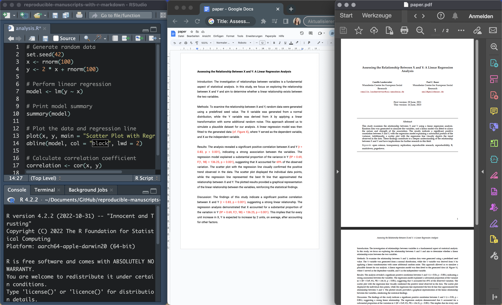
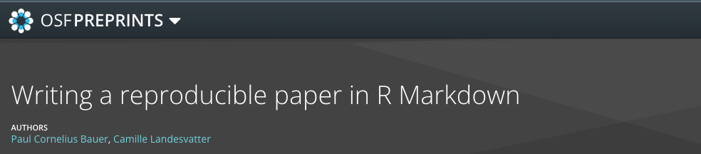
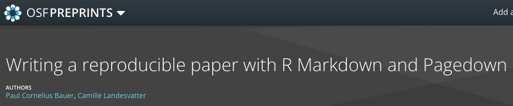
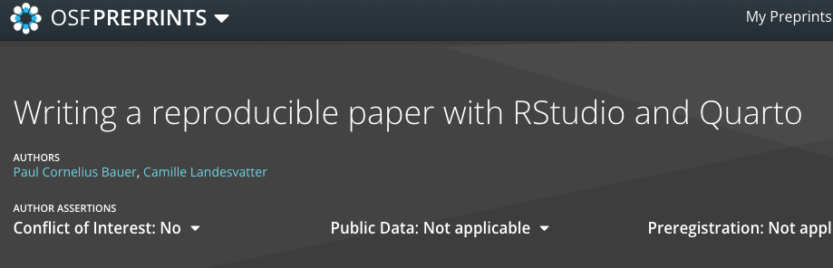

```{r setup, include=FALSE}
## Save package names as a vector of strings
pkgs <-
  c("rmarkdown",
    "knitr",
    "dplyr",
    "devtools",
    "widgetframe",
    "RefManageR",
    "bibtex",
    "plotly",
    "fontawesome")

## Install uninstalled packages
lapply(pkgs[!(pkgs %in% installed.packages())], install.packages)

## Load all packages to library and adjust options
lapply(pkgs, library, character.only = TRUE)

## Devtools install
if (!("icons" %in% installed.packages()))
  devtools::install_github("ropenscilabs/icons")
library(icons)

## Global chunk options
knitr::opts_chunk$set(echo = FALSE,
                      warning = FALSE,
                      message = FALSE)
options(scipen=999)
options(htmltools.dir.version = FALSE)

## RefManageR options
BibOptions(
  bib.style = "authoryear",
  hyperlink = "to.bib",
  style = "markdown",
  max.names = 3L
)
```

# What is a Reproducible Manuscript?

.pull-left[
<blockquote><font size="5">A reproducible manuscript is a research document that includes all the necessary information and code to reproduce the reported findings and results.</font size></blockquote>

<blockquote><font size="5">It combines the traditional elements of a manuscript (text, figures, tables) with the computational code used for data analysis and visualizations.</font size></blockquote>
]


.pull-right[
- Reproducible Manuscripts versus "Traditional Workflows"?

```{r, out.width = "100%", fig.align='center', echo=F, fig.cap="A 'traditional' workflow with 3 tabs open"}

```
]
---
class: center, middle
<font size="6">
How do you currently incorporate your research findings into your paper manuscript?

Let us know on Slido:<br>
https://app.sli.do/event/m8n4VwLfmo1a9yHT6NViyH
</font size>

---

# Why Reproducible Manuscripts?

- .cyan[Trust and Credibility]: Reproducible manuscripts enhance the integrity of research, as it allows for thorough scrutiny of methods, data, and analyses. They allow others to independently verify and replicate the reported results.


- .cyan[Efficiency]: Adopting reproducible workflows improves efficiency, as researchers can easily update and modify their work, easily spot errors and save time in the long run.


* .cyan[Sharing and Collaboration]: By providing transparent and accessible documentation of methods, data, and code, reproducible manuscripts promote collaboration and allow others to build upon and replicate the research findings. This efficient sharing of knowledge fosters faster progress in scientific discovery and innovation.
---

# How to create Reproducible Manuscripts...

- ... using R Markdown?

```{r, out.width = "80%", fig.align='center', echo=F, fig.cap="Coding Language // Framework // R Markdown related packages"}
magick <- magick::image_read_pdf("workflow.pdf",
                       pages=1)
magick <- magick::image_trim(magick)
magick
```
---
# R Markdown

- R Markdown is a powerful tool that allows you to blend text, code, and output in a single document.
- essential tool for reproducible research and creating dynamic reports, manuscripts, presentations and many more.

**rmarkdown** package (Allaire et al. 2023)

- the powerhouse behind R Markdown, providing the tools and functions to render your documents into different formats like HTML, PDF, Word, and more.
- allows you to effortlessly switch between output formats, making it easy to share your work with collaborators, supervisors, or even publish it online.
  - but also consider documenting your data analysis process with Rmd
- using R Markdown eliminates the need for manual updates or copy-pasting code and results into different documents, saving you time and reducing the chances of errors.

---
# R Markdown: Template (Bauer & Landesvatter 2023)

OSF: https://osf.io/q395s

`r icons::fontawesome("google-drive")`:
[/2021_Writing_a_reproducable_paper_in_rmarkdown](https://drive.google.com/drive/folders/1zJP3cNPrHN-gj0rcmbHQgg-XA0hqDXdd)


`r icons::fontawesome("github")`: [/paulcbauer/Writing_a_reproducable_paper_in_rmarkdown](https://github.com/paulcbauer/Writing_a_reproducable_paper_in_rmarkdown)

.pull-left[

<font size="4">

```{r, out.width = "100%", fig.align='center', fig.cap="Bauer, P.; Landesvatter, C. 2023", echo=F}

```


]

.pull-right[
How can you use this templates?
  * download all available files: 
    * 'paper.rmd'
    * 'references.bib'
    * 'data.csv'
    * 'american-sociological-association.csl'
  * open .Rproj
  * start creating your first manuscript in rmd, use our working paper (wp) style or modify the styling sheets
]


---
# Pagedown (Xie et al. 2022)

* R Markdown based extension
* create paginated HTML reports that are converted into PDF format
* add headers, footers, page numbers, and more to your documents
* by specifying YAML metadata, you can customize various aspects of your document's style, such as fonts, colors, margins, and page dimensions
  * HTML and CSS styling sheets
* pagedown offers a range of pre-built templates for different purposes, such as CVs, theses, letters, and journal articles, making it easy to get started
* create professional-looking documents without the need for complex LaTeX formatting or advanced CSS knowledge
* greate choice for generating polished reports or preparing documents that require a print-ready PDF format


---
# Pagedown: Template (Bauer & Landesvatter 2023)

.pull-left[
<font size="4">

OSF: https://osf.io/k8jhx/

`r icons::fontawesome("github")`: [/paulcbauer/Writing_a_reproducable_paper_in_pagedown](https://github.com/paulcbauer/Writing_a_reproducable_paper_in_pagedown)

`r icons::fontawesome("google-drive")`: [/2021_Writing_a_reproducable_paper_in_pagedown](https://drive.google.com/drive/folders/1rWzj-Bu1EKqkSuE1gaFzduBJhzlThpkw)

```{r, out.width = "100%", fig.align='center', fig.cap="Bauer, P.; Landesvatter, C. 2023", echo=F}

```
]

</font size>

.pull-right[
```{r, out.width = "100%", fig.align='center', echo=F}
knitr::include_graphics("pagedown-wp-style.png")
```
]


---
# Pre-Requisites for R Markdown and Pagedown

Both require: installation of R + recommended: Rstudio IDE 

* R Markdown: 
  * rmarkdown package + other dependencies, e.g. knitr package
  * for working without Rstudio: Pandoc Installation
  * for PDF output: a LaTeX distribution, e.g. tinytex (a lightweight, cross-platform LaTeX distribution) 

```{r eval=F, echo=T}
install.packages(c('tinytex', 'rmarkdown'))
tinytex::install_tinytex()
```

* Pagedown:
  * rmarkdown package + other dependencies, e.g. knitr 
  * pagedown package
  * no LaTeX!
  
```{r eval=F, echo=T}
remotes::install_github('rstudio/pagedown')
```


---
class: center, middle

# Structure of a Reproducible Manuscript (.Rmd)

Demonstration in R Studio<br>
`r icons::fontawesome("github")`: [/paulcbauer/Writing_a_reproducable_paper_in_rmarkdown](https://github.com/paulcbauer/Writing_a_reproducable_paper_in_rmarkdown)


---
class: center, middle

# Some more packages (Xaringan, Trackdown, Quarto)


---
# Xaringan (Xie 2021)

- R Studio add-in Infinite Moon Reader

- preview live changes while editing your files or even manuscript

- avoids manually knitting your document each time

```{r xaringan-inf-mr, eval=F, echo=T}
xaringan::inf_mr()
```

- launches a local web server via the servr package (Xie 2021) and displays your pages in the RStudio viewer

- each time you save your document (Ctrl/Cmd+S) xaringan updates your pages in the viewer.


---
# Xaringans' Infinite Moon Reader

```{r, out.width = "100%", fig.align='center', echo=F}
knitr::include_graphics("xaringan-inf-moonreader.png")
```


---
# Trackdown

- R trackdown package for improving collaborative writing

`r icons::fontawesome("github")`: [ClaudioZandonella/trackdown
](https://github.com/ClaudioZandonella/trackdown)

- collaborative workflow for the writing and editing process with R Markdown
- upload local .Rmd (or .Rnw) file as a plain-text file to Google Drive
- use Markdown (or LaTeX) syntax and Google Docs options (e.g. suggest edits, add comments)
- review and integrate all contributions
- the final document can be downloaded and rendered locally


---
# R trackdown package for improving collaborative writing

```{r trackdown-install, eval=F, echo=T}
remotes::install_github("claudiozandonella/trackdown",
                        build_vignettes = TRUE)
```

```{r trackdown-example, eval=F, echo=T}
upload_file(file = "trackdown_example.Rmd",
            gpath = "trackdown_example",
            hide_code = TRUE)
```

- `download_file()`
- `update_file()`
- `render_file()`

---
# Quarto

- Quarto is often referred to as "the next generation of R Markdown"

- main goal: seamlessly integrate narrative text and code, allowing for the generation of nicely formatted output documents

- like R Markdown, Quarto utilizes Knitr to execute R code, which means that most existing Rmd files can be rendered in Quarto without requiring extensive modifications

---
# Rmd versus Quarto

- Quarto comes with enhanced support for interactive and dynamic documents (versus static documents)

- Quarto supports multiple programming languages (e.g. R, Python, Julia, and Observable JS) - by adding Lua filters to the pandoc metadata, it achieves a cross-language standardization of outputs

- Template? OSF: https://osf.io/ur4xn

`r icons::fontawesome("github")`: [/paulcbauer/Writing_a_reproducable_paper_with_quarto](https://github.com/paulcbauer/Writing_a_reproducable_paper_with_quarto)

```{r, out.width = "50%", fig.align='center', fig.cap="Bauer, P.; Landesvatter, C. 2023", echo=F}

```


<!-- - best explained as a extension to rmd, which works as follows: .Rmd -> knitr -> md -> pandoc -> report/presentations/projects -->
<!-- - quarto: .Qmd -> knitr -> md -> pandoc with Lua filter (conversion layer now includes Lua filters) -> report/presentations/projects -->
<!-- - Lua Filters = including latex in pandoc metadata -->
<!-- - conversion layer (pandoc) now includes Lua filters, this is beyond rad and knits, for example this allows using many other languages, Julia, python -->
<!-- - allows going beyond R (because pre-processing of documents is done within Lua filters outside R run session), for example you could render your Jupyter notebook .ipynb which you created in a JupyterLab editor and not RStudio text editor (or in the case of RStudio even IDE) -->
<!-- objective: standardizes reports and documents across languages, same yaml etc -->

---
class: center, middle

# Thank you!


`r icons::fontawesome("github")`: clandesv/reproducible-manuscripts-with-r-markdown

Xaringan Presentation on GitHub Pages: https://clandesv.github.io/reproducible-manuscripts-with-rmarkdown/slides.html


